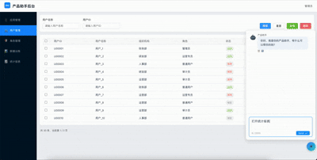
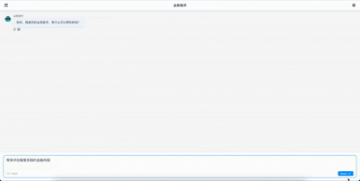

# 通用AI应用架构 - Intent-Driven-UI

- **版本号：** V0.5
- **拟稿人：** 李照鹏
- **时间：** 2026-02-06

---

## 1. 背景与现状

### 1.1 现状分析

当前，我们面对的是一个个深耕多年、承载大量定制化业务场景的业务中台系统。在对系统进行AI赋能的过程中，我们发现纯文本的AI交互模式在体验上远不如现有成熟业务系统直观高效。因此，我们亟需引入一种全新的交互模式——通过AI识别用户意图，动态驱动对应的业务组件进行展示，从而推动交互方式从传统的鼠标操作向“AI驱动”的界面转变，实现AI与现有业务场景的深度结合。

在AI应用开发中，交互体验的“最后一公里”至关重要，它是将AI的“智慧”转化为用户“所见”的关键环节。若此处衔接不畅，即使意图识别再准确，整体体验也会大打折扣。


### 1.2 痛点与瓶颈

在当前的AI交互模式下，我们主要面临以下核心瓶颈：

- **交互体验割裂：** 成熟的图形化业务逻辑与纯文本对话模式难以有机融合。用户在进行复杂业务操作时，AI的辅助效率与体验远不及传统业务系统，造成明显的体验断层。

- **赋能方式零散：** 目前的AI能力改造多为垂直场景下的单点突破，缺乏一套标准化、可复用、能贯穿不同业务的系统性驱动架构。


## 2. 核心原则

在架构设计之初，我们确立了核心目标：构建一套能够快速适配各类业务场景的通用AI应用架构。为确保其长期生命力与广泛适用性，我们严格遵循以下设计原则：

*   **通用性 (Universality)**：核心架构与业务逻辑解耦。系统通过大模型的语义理解能力进行任务分发，而非硬编码业务规则，确保架构可跨业务线复用。
*   **模块化 (Modularity)**：采用“原子化”设计。每个智能体（Agent）和工具（Tool）都是独立的模块，支持独立开发、测试、热插拔。
*   **可扩展性 (Scalability)**：遵循“微内核，富生态”理念。通信总线和调度中枢保持轻量，通过增加 Plugin（工具）和 Agent（智能体）来扩展系统能力边界。
*   **安全性 (Security)**：构筑“人机协同”安全防线。在关键指令执行链路中嵌入审批与校验模块，建立明确的数据隐私与操作安全围栏。

## 3. 通用AI架构 - 意图驱动UI

这是一个Monorepo项目，使用pnpm进行管理，项目结构如下：


### 3.1 项目目录
```
├── apps   // 应用
│   ├── web  // 前端应用 vue3+vite
│   ├── express  // 远程组件服务 express + typescript
│   └── backend  // 后端应用 nestjs
├── packages
│   ├── shared  // 公共UI组件库
│   └── remote  // 前端远程组件库
├── docs  // 文档
├── configs  // 配置
├── .gitignore
├── package.json
└── README.md
```

### 3.2 项目架构

- apps/web - 基于Vite+Vue3+TypeScript的前端应用
- apps/backend - 基于Node.js+TypeScript+NestJS的后端应用
- packages/shared - 基于Vite+Vue3+TypeScript的公共UI组件库
- docs - 基于VitePress的文档项目
- configs - 配置文件

### 3.3 项目启动

```shell
git clone https://github.com/Zroclee/Intent-Driven-UI.git

cd Intent-Driven-UI

pnpm install 

# 启动前端应用
pnpm run dev:web

# 启动远程组件服务
pnpm run dev:express

# 启动后端应用  
pnpm run dev:backend

```


### 4. 原型展示

！！！ 注意：以下原型展示仅为演示目的，实际应用中可能会有差异。
- 系统智能助手原型演示


- 业务AI助手原型演示

