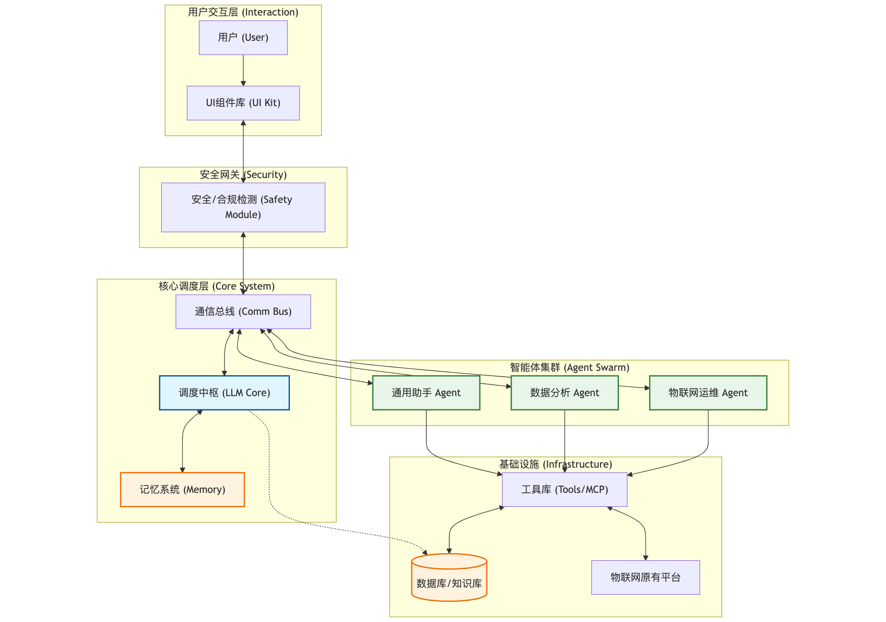

# 通用 AI 应用架构设计说明书 (AI System)

**版本号**：V0.1
**拟稿人**：李照鹏
**日期**：2025-12-17

---

## 1. 背景与现状 (Background & Status Quo)

### 1.1 现状分析
随着行内数字化转型的深入，各业务条线对于 AI 赋能的需求呈爆发式增长。目前，虽然内部已部署 BankGPT 平台，但其提供的 AI 应用相对基础，主要集中在通用对话层面，难以深入复杂的垂直业务场景，无法满足深度的业务定制化需求。

### 1.2 痛点与瓶颈

当前在推进 AI 落地过程中，我们面临以下主要瓶颈：
*   **架构割裂与重复造轮子**：各子系统业务需求迥异，技术栈不统一。团队在进行 AI 改造时往往各自为战，缺乏统一的顶层架构设计，导致开发成本高，维护困难。
*   **交互体验不一致**：缺乏一套专门针对 AI 交互场景（如流式输出、意图识别反馈）的公共 UI 组件库，导致各应用的前端体验五花八门，用户学习成本高。
*   **协同能力不足**：现有的单体 AI 模型难以处理复杂的长链路任务，缺乏多智能体（Multi-Agent）协作的调度机制。

---

## 2. 项目目标 (Project Objectives)

本项目不仅仅是一次单一系统的升级，更是一次技术范式的重构。我们的核心目标是“**以点带面，构建标准**”：

1.  **构建通用架构范式**：建设一个由大模型（LLM）主导的、多智能体协作的通用 AI 系统架构（AI System）。该架构需具备高度的适配性，能够低成本地应用到其他业务子系统中。
2.  **沉淀 AI-Native UI 组件库**：开发一套开箱即用、适配多主题的 AI 专属 UI 组件库，统一全行 AI 应用的交互体验。
3.  **物联网平台 AI 化示范**：以物联网平台为首个试点项目（Pilot Project），通过实战验证架构的可行性，实现业务流程的智能化升级（如智能运维、报表生成等），并以此为蓝本输出改造案例。

---

## 3. 设计理念 (Design Philosophy)

为了确保架构的生命力和普适性，我们遵循以下设计原则：

*   **通用性 (Universality)**：核心架构与业务逻辑解耦。系统通过大模型的语义理解能力进行任务分发，而非硬编码业务规则，确保架构可跨业务线复用。
*   **模块化 (Modularity)**：采用“原子化”设计。每个智能体（Agent）和工具（Tool）都是独立的模块，支持独立开发、测试、热插拔。
*   **可扩展性 (Scalability)**：遵循“微内核，富生态”理念。通信总线和调度中枢保持轻量，通过增加 Plugin（工具）和 Agent（智能体）来扩展系统能力边界。
*   **安全性 (Security)**：构建“人机回环”与安全围栏。在执行关键操作前引入安全校验模块，确保指令执行合规，严控数据隐私边界。

---

## 4. 系统架构设计 (System Architecture Design)

本架构的核心思想是 **“LLM Core as Orchestrator”**（大模型即调度器）。系统通过调度中枢协调特定领域的智能体，配合工具库和记忆系统完成复杂任务。

### 4.1 架构全景图

系统调用流程图

### 4.2 核心组件详解

1.  **调度中枢 (LLM Core)**
    *   **职责**：系统的大脑。负责意图识别、任务拆解（Chain of Thought）、智能体路由以及最终结果的汇总与润色。
    *   **机制**：接收自然语言指令，判断是否需要调用工具或子智能体，维护对话上下文。

2.  **智能体 (Agents)**
    *   **职责**：垂直领域的专家。例如“物联网设备诊断专家”或“理财顾问”。
    *   **构成**：Prompt System（人设与约束） + Specialized Skills（专属工具集）。

3.  **工具库 (Tools/MCP)**
    *   **职责**：系统的手脚。将现有的后端服务（API）封装为 LLM 可理解的函数（Function Calling）。
    *   **内容**：包括数据库查询、API 调用、计算器、代码执行器等。

4.  **记忆系统 (Memory)**
    *   **职责**：提供连续性体验。
    *   **分层**：
        *   *短期记忆*：当前会话上下文。
        *   *长期记忆*：用户偏好、历史任务结果（基于向量数据库检索）。

5.  **通信总线 (Communication Bus)**
    *   **职责**：标准化的消息传递通道，确保 LLM、Agent 和 Tools 之间的数据流转格式统一（如统一采用 JSON Schema）。

6.  **安全模块 (Safety Module)**
    *   **职责**：输入侧进行提示词注入防御，输出侧进行敏感数据脱敏和合规性检查。

---

## 5. UI 组件库建设规划 (UI Component Library)

为了支撑 AI 应用的快速开发，我们将构建一套**适用于AI应用的UI组件库**。

### 5.1 组件库特性
*   **智能化适配**：内置流式响应（Streaming）渲染逻辑，支持 Markdown 实时渲染。
*   **开箱即用**：提供典型的 AI 对话页面模板，降低前端接入门槛。
*   **多端/多主题**：适配 PC 与移动端，支持深色/浅色模式切换。

### 5.2 核心组件列表 (V1.0)

| 组件名称      | 类型 | 功能描述                                  | 适用场景             |
| :------------ | :--- | :---------------------------------------- | :------------------- |
| **Container** | 布局 | AI 对话主容器，自适应高度与宽度           | 所有页面基础         |
| **Layout**    | 布局 | 典型的左侧历史/设置，右侧对话布局         | 标准桌面端 AI 应用   |
| **Bubble**    | 展示 | 对话气泡，区分 User/AI 角色，支持加载状态 | 核心对话流           |
| **Markdown**  | 展示 | 渲染 AI 生成的富文本、代码块、表格        | AI 回复内容展示      |
| **Input**     | 交互 | 多行文本输入框，支持自动高度、快捷键发送  | 用户输入             |
| **Prompt**    | 交互 | 快捷指令提示、输入联想                    | 引导用户提问         |
| **FileList**  | 数据 | 上传文件展示、解析状态进度条              | 知识库问答、文档分析 |
| **Select**    | 交互 | 模型切换、插件选择下拉框                  | 配置选项             |
| **Button**    | 交互 | AI 风格按钮（如重新生成、停止响应、复制） | 操作控制             |
| **Header**    | 导航 | 应用顶部导航，包含 Token 消耗、设置入口   | 全局导航             |
| **List**      | 展示 | 历史会话列表、知识库列表                  | 侧边栏导航           |

---

## 6. 实施路径：物联网平台试点

基于物联网平台庞大且复杂的业务场景（50+ 应用），它是验证通用 AI 架构的最佳试验场。

### 阶段一：场景选型与基础建设 (Month 1)
*   **选定场景**：选取 **“BI大屏”** 和 **“统计报表”** 作为首批切入点。
*   **技术准备**：搭建 LLM 调度中枢基础框架；完成向量数据库部署。

### 阶段二：后端工具化改造 (Month 2)
*   **API 标准化**：将物联网平台现有的查询设备、获取日志、重启设备等接口，封装为符合 OpenAI Function Calling 标准的 Tools。
*   **Prompt 工程**：开发“运维专家智能体”的系统提示词。

### 阶段三：前端与组件库并行开发 (Month 3)
*   **UI 库开发**：完成基础组件（Bubble, Input, Markdown）的开发与发布。
*   **界面集成**：使用新 UI 库构建物联网 AI 助手的前端界面。

### 阶段四：测试与迭代 (Month 4)
*   **联调测试**：验证“用户指令 -> LLM 识别 -> Tool 调用 -> 结果反馈”全链路。
*   **业务试运行**：在小范围业务组内投放，收集反馈（如回答准确率、响应速度）。

### 阶段五：标准化与推广 (Month 5+)
*   **架构沉淀**：将核心代码剥离为 SDK/脚手架。
*   **组件库开源**：在行内技术社区发布 UI 组件库文档。
*   **复制推广**：启动第二个业务系统（如车联网或智能能源）的改造。

---

**结语**：
本架构设计旨在通过物联网平台的实战，打通 AI 应用落地的“最后一公里”，实现从“由于 AI 而 AI”到“AI 驱动业务提效”的转变。通过构建统一的架构与 UI 标准，我们将极大降低后续 AI 应用的边际开发成本。

