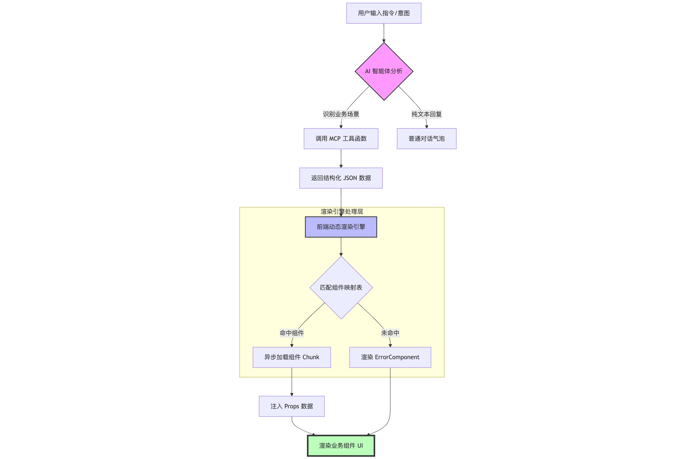
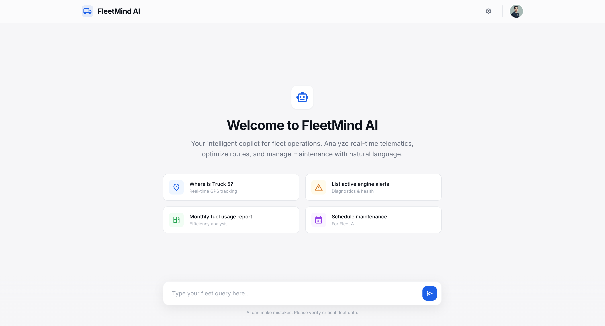
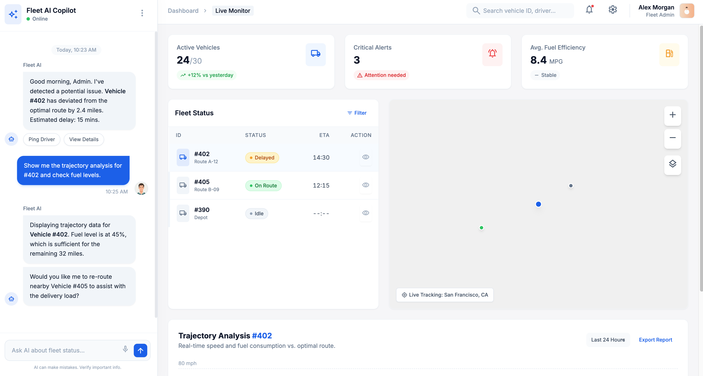

# 通用AI系统架构设计 - 前端AI驱动架构设计

---
***版本号：*** V0.2
***拟稿人：*** 李照鹏
***时间：*** 2026-01-12
---

## 1. 背景与现状


### 1.1 现状分析

在[通用AI架构设计的第一版](./通用AI应用架构设计-第一版.md)中我们完成了后端服务架构和公共UI组件库的基础构建。

当前，我们面对的是深耕多年、堆积大量定制化场景的业务系统，想对上述业务场景进行AI赋能，传统的AI纯文本对话的交互模式体验远远不如成熟的业务系统。我们需要一种全新的交互模式，由AI识别业务场景意图，动态驱动前端页面组件展示，实现“AI驱动功能组件”的转变，将AI与现有业务场景进行深度结合。


### 1.2 痛点与瓶颈

当前AI交互模式下，我们面临一下主要瓶颈：

*   **交互体验割裂：**：成熟的业务逻辑与单纯的文本对话框无法有机融合，导致用户在高阶业务操作时AI表现不如传统业务系统，体验割裂。
*   **AI赋能系统性**：目前的AI改造多聚焦于个垂直领域的点状突破，缺乏一套标准化的、可复用的、系统性的AI驱动架构体系。
*   **多模态能力不足**：现有的多模态大模型在文字生成、数值精度、图表生成及生成速度上存在缺陷或不足，想通过多模态的方式替换现有业务场景还有差距。


## 2. 核心设计思想

1.  **意图驱动视图 (Intent-driven UI)**：前端渲染完全由对话生成的结构化业务数据决定，实现“数据即视图”。
2.  **约定优于配置 (Convention over Configuration)**：通过标准化的 MCP 协议约定数据结构，确保 AI 输出与前端组件精准匹配。
3.  **组件原子化 (Atomic Components)**：每业务组件作为独立单元，保持高内聚、低耦合，通过标准 props 进行驱动。
4.  **按需加载与性能优化 (Asynchronous Loading & Performance)**：利用异步加载技术，仅在 AI 触发特定场景时加载对应代码包，优化性能。

---


## 3. 架构设计方案

### 3.1 制定数据协议 (Data Contract)

这是整个架构的基石。我们需要和智能体开发团队、MCP服务开发团队约定一个清晰、一致的数据结构。通常，这是一个包含多个组件配置对象的数组。

**建议的数据结构：**
智能体调用工具（tools/mcp）返回的结果，每个结果都包含数据和组件信息。

```json
{
    "componentName": "UserInfoCard",
    "componentId": "user-info-unique-id-123",
    "props": {
      "userId": "c1234123",
      "data": [
        {
          "id": "001",
          "key": "value"
        }
      ],
    }
  }
```

**用 TypeScript 定义类型：**
在项目中创建一个 `types.ts` 或类似文件来定义类型，确保类型安全。

```typescript
// src/types/dynamic-components.ts

// 每个业务组件自己的 Props 类型
export interface UserInfoCardProps {
  userId: string;
  showAvatar: boolean;
  level: string;
}

export interface SalesChartProps {
  chartType: 'bar' | 'line';
  timeRange: string;
}

export interface ArticleListProps {
  category: string;
  limit: number;
}

// ... 其他组件的 Props

// 动态组件的配置单元
export interface ComponentConfig<T = any> {
  componentName: string; // 组件的唯一标识名
  componentId: string;   // 用于 v-for 的 key，必须唯一
  props: T;              // 传递给组件的 props，类型为泛型
}

// API 返回的完整数据类型
export type PageSchema = ComponentConfig[];
```

---

#### 3.2 业务组件设计

每个业务组件都应该是一个标准的 Vue 组件，接收 `props` 并渲染。

**示例：`UserInfoCard.vue`**

```vue
<template>
  <div class="user-info-card">
    
    <p>用户ID: {{ props.userId }}</p>
    <p>等级: {{ props.level }}</p>
  </div>
</template>

<script setup lang="ts">
import { ref, onMounted, type PropType } from 'vue';
import type { UserInfoCardProps } from '@/types/dynamic-components';

// 使用 PropType 来获得更精确的类型推断
const props = defineProps({
  userId: {
    type: String,
    required: true,
  },
  showAvatar: {
    type: Boolean,
    default: true,
  },
  level: {
    type: String,
    required: true,
  }
});

const avatarUrl = ref('');

onMounted(() => {
  // 可以在组件内部根据 props 获取更详细的数据
  console.log('UserInfoCard mounted with props:', props);
  // 伪代码：fetchAvatar(props.userId).then(url => avatarUrl.value = url);
});
</script>

<style scoped>
.user-info-card {
  border: 1px solid #ccc;
  padding: 16px;
  margin: 10px;
  border-radius: 8px;
}
</style>
```

---

#### 3.3 动态渲染引擎

这是实现动态加载的核心。我们将创建一个“渲染器”或“解析器”组件，它负责获取数据、解析并动态渲染列表。

**核心技术：**

*   **`<component :is="">`**：Vue 内置的动态组件，`:is` 属性可以接收一个组件的定义对象。
*   **`defineAsyncComponent`**：Vue 提供的用于异步加载组件的方法，支持代码分割（Code Splitting）。

**实现步骤：**

**A. 创建组件映射**

我们需要一个地方来维护 `componentName` 字符串和实际 Vue 组件文件的映射关系。

```typescript
// src/components/dynamic-loader/component-map.ts
import { defineAsyncComponent, type Component } from 'vue';

// 使用 defineAsyncComponent 实现异步加载
// 这会为每个组件创建一个单独的 chunk 文件
const components: Record<string, Component> = {
  UserInfoCard: defineAsyncComponent(() => import('@/components/business/UserInfoCard.vue')),
  SalesChart: defineAsyncComponent(() => import('@/components/business/SalesChart.vue')),
  ArticleList: defineAsyncComponent(() => import('@/components/business/ArticleList.vue')),
  
  // 当组件加载失败时，显示一个错误提示组件
  ErrorComponent: defineAsyncComponent(() => import('./ErrorComponent.vue')),
};

export function getComponentByName(name: string): Component {
  return components[name] || components['ErrorComponent'];
}
```

> **架构决策点**:
>
> *   **Vite 特性**: 如果你使用 Vite，也可以利用 `import.meta.glob` 来自动生成这个映射，无需手动维护，更具扩展性。
>
> ```typescript
> // 自动映射版本
> const modules = import.meta.glob('@/components/business/*.vue');
> const components: Record<string, Component> = {};
> for (const path in modules) {
>   const componentName = path.split('/').pop()?.replace('.vue', '');
>   if (componentName) {
>     components[componentName] = defineAsyncComponent(modules[path] as any);
>   }
> }
> ```

**B. 创建动态渲染器组件 `DynamicRenderer.vue`**

```vue
<template>
  <div class="dynamic-renderer">
    <!-- Vue 3.3+ 支持在模板中直接使用 import 的类型 -->
    <template v-for="config in pageSchema" :key="config.componentId">
      <component
        :is="getComponent(config.componentName)"
        v-bind="config.props"
      />
    </template>
  </div>
</template>

<script setup lang="ts">
import { ref, onMounted } from 'vue';
import type { PageSchema } from '@/types/dynamic-components';
import { getComponentByName } from './component-map';

// 假设从 API 获取数据
const pageSchema = ref<PageSchema>([]);

// 包装一下，方便在模板中使用
function getComponent(name: string) {
  return getComponentByName(name);
}

</script>
```

---

### 3.4 优化与扩展

一个完整的架构还需要考虑以下几点：

| 关注点                           | 解决方案                                                                                                                                                                                       |
| :------------------------------- | :--------------------------------------------------------------------------------------------------------------------------------------------------------------------------------------------- |
| **加载状态 (Loading State)**     | `defineAsyncComponent` 支持配置 `loadingComponent` 选项，可以在异步组件加载完成前显示一个占位符（Skeleton Screen）。Vue 的 `<Suspense>` 组件也是一个很好的选择，可以为整个组件树提供加载状态。 |
| **错误处理 (Error Handling)**    | `defineAsyncComponent` 支持 `errorComponent` 选项，当组件加载失败时（如网络错误或组件不存在），可以渲染一个统一的错误提示组件。我在上面的 `getComponentByName` 中已经实现了一个备用逻辑。      |
| **文件结构 (Project Structure)** | 建议将可动态加载的业务组件放在一个专门的目录，如 `src/components/business/`，渲染器等核心逻辑放在 `src/components/dynamic-loader/`。                                                           |
| **组件间通信**                   | 如果动态加载的组件之间需要通信，应避免直接引用。可以采用 `Provide/Inject`、`Pinia/Vuex` 状态管理库，或者通过一个事件总线（Event Bus）来实现解耦。                                              |

## 4. 渲染流程图和页面效果
业务组件渲染流程图：

默认页面示例

业务组件动态加载页面示例


## 5. 总结

这个架构方案的核心优势在于：

*   **高度灵活性**：可根据智能体调用结果任意组合、排序、增删组件，前端无需改动代码即可动态调整页面布局和内容。
*   **可维护性强**：业务组件和渲染引擎分离，职责单一。新增一个业务组件，只需开发组件本身，并配置到工具（tool/mcp）中。
*   **高性能**：通过 `defineAsyncComponent` 实现按需加载，优化了初始加载性能。
*   **类型安全**：借助 TypeScript，从数据协议到组件 Props 都有完整的类型定义，大大减少了运行时错误。
