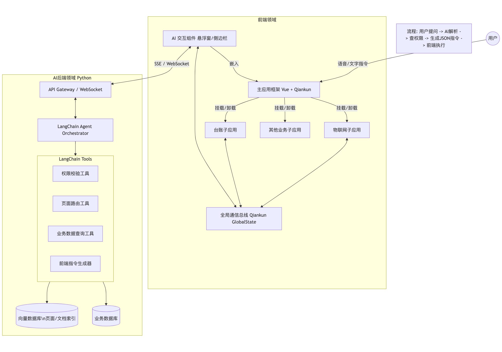
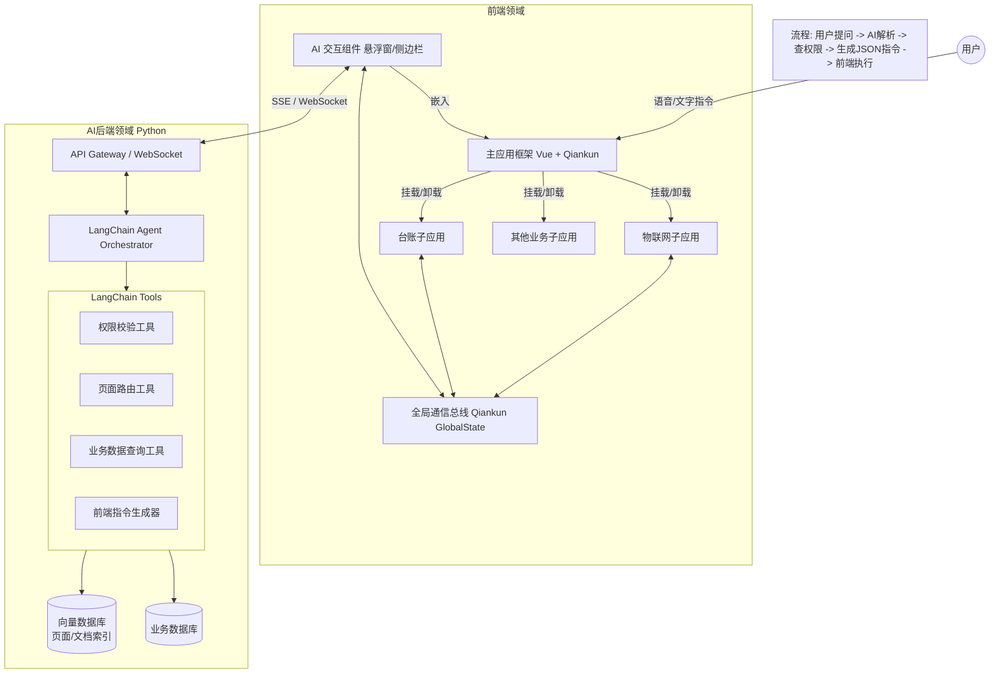

# 通用AI应用架构设计-4页面级接入方案

---

- **版本号：** V0.4
- **拟稿人：** 李照鹏
- **时间：** 2026-01-29

---

这是一个非常前沿且具有高业务价值的架构设计挑战。你想要实现的不仅仅是一个“问答机器人”，而是一个**“Copilot（副驾驶）”**或**“Agentic UI（代理式交互）”**系统。

核心难点在于：**如何让非结构化的自然语言（LLM）准确控制结构化的业务系统（20+页面、微前端、权限），并实现双向交互。**

以下是基于 **Python + LangChain** (后端) 和 **Vue + Qiankun** (前端) 的架构设计方案。

---

### 1. 核心设计理念：AI 也就是“超级路由”与“业务大脑”

在这个架构中，AI 不再只是侧边栏的一个对话框，它是系统的**中枢控制器**。

* **意图识别 (Intent Recognition):** 将用户的“我想看某某车”转化为系统指令。
* **语义路由 (Semantic Routing):** 摒弃传统的硬编码菜单，建立“页面/功能向量索引”，AI 决定跳转哪里。
* **双向通信 (Bi-directional IO):** 前端不仅接收指令跳转，还要将当前页面的数据快照 (Context) 喂给 AI 进行分析。

---

### 2. 系统架构图 (Mermaid)

这是一个高层架构图，展示了用户、前端宿主、微应用与后端 AI Agent 的交互关系。





---

### 3. 详细模块设计

#### A. 后端设计 (Python + LangChain)

后端是系统的“大脑”，需要维护一个**系统注册表（System Registry）**。

1. **页面/场景注册表 (Page Registry):**
* 你需要将20+个页面进行语义化描述，存入向量数据库（如 FAISS, Chroma 或 pgvector）。
* *结构示例:*
```json
{
  "page_id": "iot_vehicle_detail",
  "route_path": "/iot/vehicles/detail/:id",
  "description": "展示车辆的详细信息，包含传感器数据、行驶轨迹和报警记录。",
  "required_permission": "iot:vehicle:view",
  "parameters": ["vehicle_id"]
}

```


2. **LangChain Agent 架构:**
* 使用 `OpenAI Functions Agent` 或 `ReAct Agent`。
* **核心 Tool 1: `check_permission(user_id, permission_code)**`: 查询用户是否有权访问目标页面。
* **核心 Tool 2: `match_intent_to_page(user_query)**`: 在向量库中搜索最匹配的页面配置。
* **核心 Tool 3: `generate_ui_instruction**`: 生成前端能读懂的 JSON 指令。


3. **Prompt Engineering (提示词工程):**
* System Prompt 需要设定人设：“你是一个高级业务管理员，清楚所有菜单位置。如果是导航请求，请输出 JSON 指令；如果是分析请求，请结合上下文回答。”


#### B. 前端设计 (Vue + Qiankun)

前端是“执行者”。Qiankun 的主应用（Main App）负责承载 AI 助手，保证切换子应用时 AI 不会断开。

1. **全局 AI 组件 (Global AI Widget):**
* 位于 Main App 中，使用 WebSocket 或 SSE (Server-Sent Events) 与后端保持长连接。
* **指令解析器 (Instruction Parser):** 监听后端返回的特定事件流。


2. **通信协议 (Action Protocol):**
定义一套 AI 控制前端的标准协议。
* **导航指令:** `{ "type": "NAVIGATE", "payload": { "path": "/iot/list", "params": {...} } }`
* **高亮指令:** `{ "type": "HIGHLIGHT", "payload": { "selector": "#vehicle-table-row-1" } }`
* **数据请求:** `{ "type": "GET_CONTEXT", "payload": {} }` (AI 问前端：你现在页面上展示的是什么数据？)


3. **微应用改造 (Sub-apps):**
* 子应用需要通过 Qiankun 的 `onGlobalStateChange` 或自定义 EventBus 向主应用汇报状态。
* *场景:* 当页面加载完“车辆台账”数据后，将关键数据的摘要（或当前页面的 JSON 数据）同步给 AI 组件，以便 AI 进行分析。


---

### 4. 业务场景流程演练 (The Workflow)

我们以你提到的**“物联网车联网下钻”**为例。

#### 第一阶段：意图识别与导航 (Navigation)

1. **用户:** “我想看车牌号京A88888的车辆详细信息。”
2. **Main App:** 将文本发送给 Python Backend。
3. **LangChain Agent:**
* *Step 1 (Search):* 搜索 Page Registry，找到“车辆详情页”匹配度最高。
* *Step 2 (Check):* 调用 `check_permission` 工具，确认用户有 `iot:vehicle:view` 权限。
* *Step 3 (Extract):* 从用户语句中提取参数 `plate_number="京A88888"`。
* *Step 4 (Query ID):* (可选) 调用数据库工具将车牌转为系统 ID。


4. **Backend:** 返回 JSON 指令：
```json
{
  "action": "NAVIGATE",
  "path": "/sub-iot/vehicle-detail",
  "query": { "plate_num": "京A88888" },
  "speech": "好的，正在为您打开京A88888的车辆详情页。"
}

```


5. **Main App:** 收到指令，调用 `history.pushState` 或 Qiankun 的路由跳转方法。
6. **Sub App:** 页面加载，展示车辆信息。

#### 第二阶段：页面感知与分析 (Context Analysis)

1. **Sub App:** 页面加载完成后，通过 Qiankun GlobalState 发送当前页面数据摘要：
```javascript
// 子应用代码
props.setGlobalState({
  currentPageContext: {
    page: "vehicle-detail",
    data: { fuel_level: "10%", status: "offline", last_maintenance: "2023-01-01" }
  }
});

```


2. **Main App:** AI 组件接收到 Context 更新，暂存到本地上下文。
3. **用户:** “这辆车有什么异常吗？”
4. **LangChain:** 接收用户问题 + **当前页面 Context JSON**。
5. **LangChain:** 分析数据（油量10% -> 偏低，状态离线 -> 异常）。
6. **Backend:** 返回回答：“检测到该车辆油量仅剩10%，且处于离线状态，建议立即联系驾驶员或查看最后一次报警记录。”

---

### 5. 关键代码片段示例

#### 后端：LangChain Tool 定义 (Python)

```python
from langchain.tools import tool
from pydantic import BaseModel, Field

class NavigationInput(BaseModel):
    destination: str = Field(description="用户想去的页面名称或描述")

@tool("navigate_system", args_schema=NavigationInput)
def navigate_system(destination: str):
    """
    当用户想要跳转页面或查找功能时使用此工具。
    返回前端路由指令。
    """
    # 1. 向量搜索匹配页面
    matched_page = vector_db.similarity_search(destination, k=1)[0]
    
    # 2. 权限校验 (伪代码)
    user = get_current_user()
    if not check_perm(user, matched_page.metadata['perm']):
        return {"action": "DENY", "message": "抱歉，您没有查看该模块的权限。"}
    
    # 3. 返回指令
    return {
        "action": "NAVIGATE",
        "path": matched_page.metadata['route'],
        "message": f"已为您导航至{matched_page.metadata['name']}"
    }

```

#### 前端：指令执行器 (Vue/JavaScript)

```javascript
// MainApp / components / AICopilot.vue

function handleServerResponse(response) {
  // 语音播报 (TTS)
  if (response.speech) speak(response.speech);

  // 解析指令
  if (response.action === 'NAVIGATE') {
    // 执行路由跳转
    window.history.pushState({}, '', response.path);
    // 如果是 hash 路由或特定的微前端跳转逻辑，需适配
  } 
  else if (response.action === 'HIGHLIGHT') {
    // 高亮页面元素
    const el = document.querySelector(response.selector);
    if (el) el.style.border = "2px solid red";
  }
}

```

---

### 6. 项目落地建议

1. **逐步迁移，不要一次到位:**
* **Phase 1 (只读助手):** 仅实现介绍功能和文档查询（RAG）。
* **Phase 2 (导航助手):** 实现页面向量索引，打通路由跳转，处理权限。
* **Phase 3 (分析助手):** 实现前端向 AI 推送当前页面数据，进行数据洞察。


2. **解决微前端的隔离问题:**
* Qiankun 的样式隔离（Shadow DOM）可能会导致 AI 无法高亮子应用的元素。建议 AI 组件只负责发指令，具体的 DOM 操作逻辑（如高亮、弹窗）封装在子应用中，通过 GlobalState 触发。


3. **延迟与体验:**
* LLM 的响应有延迟。在跳转页面时，先立即显示 Loading 状态，或者先跳转页面，再流式输出 AI 的语音/文字介绍，利用页面加载的时间掩盖 AI 思考的时间。


这个架构能把死板的 B 端系统变成一个灵动的智能平台。你想先从后端的 **LangChain Agent 定义** 开始深入，还是先看 **前端 Qiankun 通信** 的具体实现？