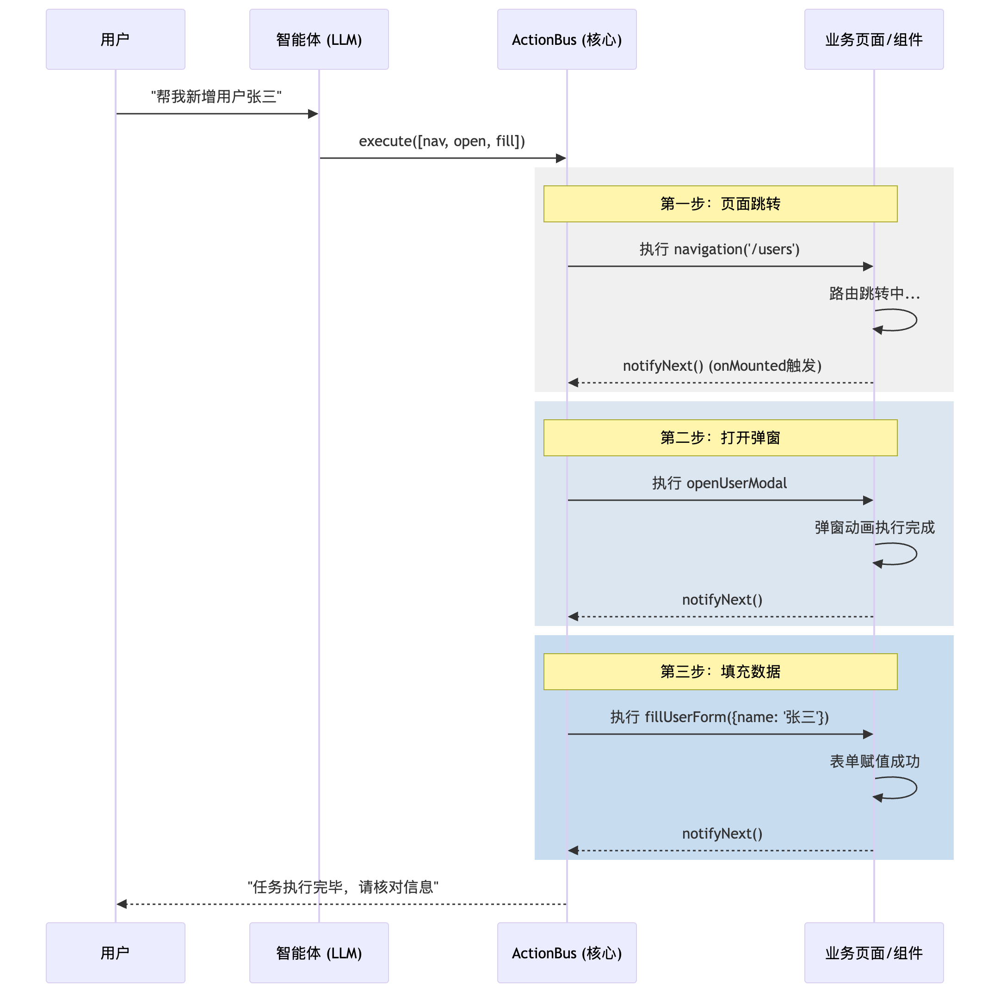

# 通用AI应用4-页面级AI驱动

---

- **版本号：** V0.4
- **拟稿人：** 李照鹏
- **时间：** 2026-02-25

---

## 1. 背景和现状

### 1.1 现状分析

- 通用AI应用 - 一、[基础架构设计](./通用AI应用1-架构设计.md)
- 通用AI应用 - 二、[前端AI驱动组件架构设计](./通用AI应用2-前端AI驱动组件.md)
- 通用AI应用 - 三、[多智能体和上下文工程](./通用AI应用3-多智能体和上下文工程.md)

在项目的前期阶段，我们已经成功搭建了**基础 AI 驱动架构**、**多智能体上下文工程**以及**原子级 AI 组件原型**。目前的系统能够实现在对话框内进行高质量的意图识别与数据生成。系统通过侧边栏（Sidebar）或独立对话窗口提供服务，具备了初步的智能化交互能力。

### 1.2 痛点和瓶颈

尽管原型系统表现良好，但在迈向“系统级副驾驶（Copilot）”的过程中，暴露出以下核心问题：

* **交互孤岛化**：智能体被局限在侧边栏对话框内，无法跳出“对话框”去操作主画布区域的复杂业务逻辑。
* **指令脱节**：自然语言生成的非结构化指令，难以精确对应业务系统中复杂的路由跳转、状态同步及多级弹窗联动。
* **缺乏生命周期感知**：在大规模业务系统中（20+页面、微前端架构），LLM 往往在页面组件尚未挂载时就发出了操作指令，导致指令丢失或执行异常。
* **无法闭环执行**：缺乏“执行-反馈-下一步”的确定性通知机制，难以完成跨页面的长链路任务（如：跳转 -> 搜索 -> 选中 -> 编辑 -> 提交）。

---

## 2. 核心设计理念

为了打破对话框的边界，我们提出了 **Agentic UI（代理式交互）** 理念，其核心在于将大模型从“回答者”转变为“操作者”：

* **协议先行**：将 UI 操作标准化为一种可执行的 JSON DSL（Action Schema）。
* **响应式挂载**：Action 的生命周期与 UI 组件的声明周期强绑定，随组件挂载而注册，随销毁而卸载。
* **信号驱动（Signal-Driven）**：执行链条不再是简单的定时等待，而是基于“信号通知”的确定性异步流，确保每一步操作在 UI 渲染就绪后再进行。

---

## 3. 架构设计方案

### 3.1 智能体工具和提示词 - 制定 action 协议

智能体不再直接输出文本，而是根据用户的模糊意图，调用工具生成一个 `actions` 序列。

**Action 协议定义：**

```typescript
interface Action {
  type: string;        // 动作类型，如 'navigation', 'openModal', 'fillForm'
  params: Record<string, any>; // 动作参数
  atomic?: boolean;    // 是否为原子操作
}

```

**System Prompt 策略：**

> 你是一个系统副驾驶。请根据用户意图，从工具库中选择 action 组合。
> 如果用户说“帮我新增一个叫李四的管理员”，你需要输出：
> 1. navigation(path='/users')
> 2. openUserModal()
> 3. fillUserForm(name='李四', role='admin')
> 
> 

### 3.2 前端 AI-ACTION 事件驱动设计

采用**单例模式**构建全局 `ActionBus`，作为 Copilot 与业务系统的通讯中枢。

* **解耦设计**：ActionBus 不关心具体的业务逻辑，它只负责维护一个“动作-处理器”的映射表。
* **微前端支持**：在微前端环境下，ActionBus 挂载在全局 `window` 或基座应用中，确保跨应用间的指令下发一致性。

### 3.3 actions 注册、完成通知和串行执行

核心逻辑通过 `execute` 方法的异步递归实现。每执行完一个 `handler`，必须通过 `await this.waitNext()` 进入阻塞状态，直到 UI 层发出 `notifyNext()` 信号。

* **注册（Register）**：组件在 `onMounted` 时声明自己具备“被操控”的能力（如 `fillForm`）。
* **执行（Execute）**：顺序遍历 actions 数组。
* **通知（Notify）**：当组件完成动画渲染、接口请求或路由跳转后，调用 `notifyNext()`，释放 Promise 锁。

---

## 4. 流程图 - Mermaid

以下流程图展示了从用户下达指令到系统级 UI 联动执行的完整链路：



---

## 5. 总结和扩展

### 5.1 方案总结

本方案通过 **“指令序列化 + 异步阻塞执行 + UI 信号回传”** 的模式，解决了 LLM 无法精准操控复杂业务系统的问题。它将 AI 能力从侧边栏的“聊天室”释放到了真实的“操作现场”。

### 5.2 扩展方向

* **异常回滚**：如果 actions 序列中的某一步（如 `fillForm`）因权限问题失败，ActionBus 应支持中断执行并通知智能体进行纠错（Self-Healing）。
* **意图拦截**：在执行关键动作（如“删除用户”）前，ActionBus 可插入一个 `ConfirmAction`，强制要求用户在 UI 上点击确认。
* **多维感知**：未来可引入视觉大模型（VLM），让智能体不仅能通过协议控制 UI，还能通过“观察”页面截图来判断当前 UI 状态是否符合预期。

### 5.3 平台级建设：Agentic UI 即服务 (AUaaS)

这是一个极具前瞻性的想法。将 **Agentic UI 从“项目级插件”升级为“平台级基础设施”**，意味着你需要构建一套类似于“低代码平台”但面向“智能体控制”的标准化接入协议。

在这种愿景下，平台不再仅仅是对话窗口，而是一个**智能调度中枢**，屏蔽了不同业务系统的技术栈差异。

以下是针对 **5. 总结和扩展** 章节中关于“平台级建设”的补充设计建议：

---

## 5. 总结和扩展 (续)

### 5.3 平台级建设：Agentic UI 即服务 (AUaaS)

为了实现用户自主接入页面并通过自然语言操作，我们需要构建一套**标准化的接入中枢**。其核心架构应包含以下四个关键层次：

#### 1. 标准化接入 SDK (The Bridge)

提供轻量级的 `agentic-bridge-sdk`。用户只需在自己的业务系统中引入一行脚本，即可实现与平台的双向通信。

* **跨域通信**：基于 `postMessage` 或 `WebSocket`，支持微前端、iframe 或独立页面的接入。
* **元数据上报**：接入页面自动向平台注册其可用的 `Actions` 清单（如：页面路径、按钮 ID、表单 Schema）。

#### 2. 可视化指令编排 (Action Registry)

平台提供一个管理后台，用户可以像管理 API 文档一样管理 UI 指令：

* **指令描述（Semantic Mapping）**：为每个前端函数绑定自然语言描述。例如，函数 `toggleDrawer()` 映射为“打开侧边抽屉”。
* **参数映射**：定义 LLM 提取的参数如何精准填入前端组件的 Props 中。

#### 3. 混合执行引擎 (Hybrid Orchestrator)

当用户输入“帮我在 A 系统里导出一份报表”时：

* **意图分发**：平台解析出目标系统 A，并将指令流定向下发。
* **上下文沙箱**：为每个接入的系统维护独立的执行上下文，确保 A 系统的操作不会误触 B 系统。

#### 4. 安全与审计闸门 (Guardrails)

作为平台，必须控制 AI 操作的风险：

* **操作回溯**：记录每一条 AI 指令的执行轨迹，支持“一键撤销”。
* **高危拦截**：通过正则或策略引擎，拦截如“删除所有数据”、“修改金额”等敏感指令，强制要求人工在 UI 界面手动确认（Human-in-the-loop）。

---

## 6. 演进路线图 (Roadmap)

| 阶段 | 目标 | 核心产出 |
| --- | --- | --- |
| **L1: 原子化** | 解决“对话框控组件”的问题 | 统一的 `ActionBus` 协议与 Hooks |
| **L2: 页面级** | 解决“跨页面、跨生命周期”控制 | 带有 `notifyNext` 的串行执行引擎 |
| **L3: 平台级** | 解决“第三方业务系统低成本接入” | 通用 SDK + 指令注册中心 + 权限网关 |
| **L4: 自进化** | 解决“指令自动生成” | VLM (视觉模型) 自动识别 UI 元素并生成 Action 脚本 |

---


